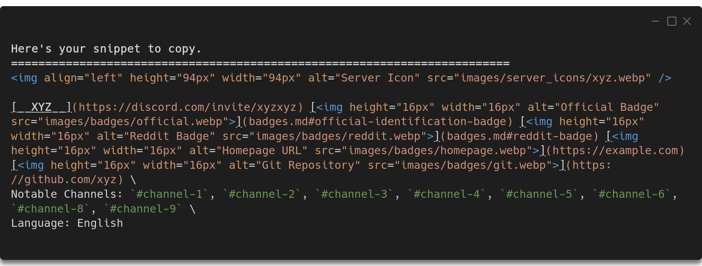

# Contribution Guidelines

This project has a [contributor code of conduct](CODE_OF_CONDUCT.md), by participating in this project you agree to abide its terms.

From here on, the word _server_ and _community_ will be used interchangebly and will mean the same thing. 

## Quality Standard

There is no real metric provided by Discord that can be used by anyone to evaluate a server. However a maintainer will manually review the community for a period of time (mostly 3-7 days) before it can get accepted. 

Only technical or technology-related communities are considered as an initial requirement. A community that is meant for people to hang out with no real active support channel will not be considered as technical. There are certain categories a technical community can fall under. **Generic**, **Niche**, and **Project**. There are few distinct requirements for each of them.

[Generic servers](./README.md#programming-in-general) try to address multiple-technical-domains-in-one instead a specific, i.e., a server that offers support for all programming languages vs. a server that offers Java only. These communities are most likely to attract a lot of people in a short period of time, and  more likely to be short-lived as it becomes more and more difficult to maintain over time. For this reason, a stricter requirement, a generic server needs to be at least a year old with active moderation and messaging activity on a daily basis (excluding the off-topic channels). This particular precondition affects generic servers only.

Niche servers are the opposite of Generics, they're geared toward a smaller domain. The requirement minimum age is six months. Communities related to cryptocurrencies are often prone to the risk of getting hacked, for this reason - for now, **only open-source owned official cryptocurrency servers will be allowed.**

Project servers are part of the associate communities of open-source projects or content creators (e.g., Twitch streamers, YouTube creators). Since the activity and growth of the server depends on the creator content itself, they can be accepted as soon there's daily or semiweekly activity. If you maintain an open-source project you might also be interested in [Discord's own open-source recognition](https://discord.com/open-source).

All three types of servers should meet the the following requirements:
 - [x] An active moderation team, it's rare for a successful moderation to be run by a single administrator. But as long as the moderation is ongoing it's fine
 - [x] A server needs to be active (on-topic channels) on a daily or semiweekly basis (except Generic which requires per-day activity)
- [x] All public channels must follow Discord's [community guidelines](https://discord.com/guidelines) and [ToS](https://discord.com/terms). 

## Prepare the Template

This project follows a tedious markdown template, but it serves an aesthetic purpose after it's rendered. 

```md
" />

[__Community Name__](url of invite link) [](badges.md#official-identification-badge) [](badges.md#reddit-badge) [](url of server homepage) [](url of server git repository) \
Notable Channels: `#most-important-channel-1`, `#most-important-channel-2`, `...`, `#least-important-channel` \
Language: English, Deutsch, 日本語
```
If you're not familiar with many of the syntax here, you can use this [simple pure Python script](./src/get_template.py) which will generate this template with only a few keyboard strokes. You only need [Python](https://www.python.org/downloads/) installed, if you're on MacOS or Linux chances are Python is already installed. Download the script and run:
```sh
python3 /path/to/get_template.py
```

We'll follow the script from here which should make this easier to understand for everybody. After every input to go forward simply hit `Enter`.

1. **Server name:** Don't put names with emoji on it, it's highly discouraged in the list.
2. **Invite link:** Only Discord-generated permanent links are allowed. This is for convenience of the end users, any third-party links will be rejected.
 


3. **Server icon:** Put a static link to the icon image, you can host the image anywhere, better if it's in your own GitHub repository. It's recommended that the image is no less than `100x100` resolution.


4. **Badges:** [Badges](./badges.md) represent your server's official homepage, sub-reddit existence, and open-source contribution. Just type and enter `yes` or `no` to the questions, and put the links accordingly. You can skip the links if you want, but if you're an official body you must put the link to your website. 


5. **Channels:** Type out the channels, order by most popular to least popular excluding all off-topic channels (e.g., watercooler channel). No need to append a hashtag before them. Channels will be truncated from the end to fit within the available padding in the main list. A [`so much more`](badges.md#so-much-more) tag will be added if there are a number of many channels. 


5. **Language:** Finally enter the language names that the community offers or dedicated channels. Don't include a language if a channel is there but there's no activity in there at all.


**Note:** The script is a bare-bone, there's no strong validation check, it will spew out whatever you input, it's only to help you write the template without putting effort on the template itself. You should follow the instructions from here.

You should see the generated snippet, you can copy/paste this to propose file change.


## Propose File Change

As for now no automated pull request is implemented, I'll do that in the future depending on the traffic of requests. You'll have to fork this project and add your server to a section or sebsection, or you can create a new section, then create a pull request. See [how to easily make changes from GitHub](https://github.com/sindresorhus/awesome/blob/master/contributing.md).

## Issues

If you've found an issue with an existing server or have a suggestion to make to improve this list, feel free to file a pull request or an [issue](https://github.com/mhxion/awesome-programming-discord/issues/new/choose) here.

Thank you for your contribution 💚