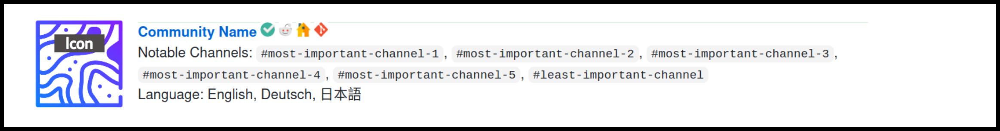

<!-- omit in toc -->
# Contribution Guidelines

By participating in this project you agree to abide by the [contributor code of conduct](CODE_OF_CONDUCT.md). From here on, the word _server_ and _community_ will be used interchangebly and mean the same thing.

- [New Community](#new-community)
- [Issues](#issues)
- [Review Policy](#review-policy)

## New Community

To add a new community, fork this project and add your server to a section or sebsection, or you can include a new section if need be, then [create a pull request](https://github.com/sindresorhus/awesome/blob/main/contributing.md). Make sure your proposal meets these requirements below, if you've Python installed you can take advantage of this [script](src/README.md).

✅ Each community follows this template

```html
" />

[__Community Name__](url of invite link) [](badges.md#official-identification-badge) [](badges.md#reddit-badge) [](url of server homepage) [](url of server git repository) \
Notable Channels: `#most-important-channel-1`, `#most-important-channel-2`, `#most-important-channel-3`, `#most-important-channel-4`, `#most-important-channel-5`, `#least-important-channel` \
Language: English, Deutsch, 日本語
```



✅ Community icon is optimized, and at least `128x128` pixel in resolution with moderate PPI

✅ Community name does not contain any emoji (discouraged)

✅ Invite link is permanent, generated from Discord platform itself, not a third-party domain

✅ [Badges](badges.md) are properly placed and aligned

✅ `Notable Channels` contains the most important channels, no off-topic channels, and does not necessarily take up too much space

✅ `Language` only contains spoken languages that the community has to offer

✅ Moderation team is regularly active

✅ Community is active on a daily or semiweekly basis

✅ All public channels follow Discord [community guidelines](https://discord.com/guidelines) and [ToS](https://discord.com/terms)

## Issues

If you've found an issue with an existing server or have a suggestion to make to improve this list, feel free to file a an issue [here](https://github.com/mhxion/awesome-discord-communities/issues/new/choose).

## Review Policy

Review policy is meant for reviewers, not necessarily for contributors. There is no real metric provided by Discord that can be used by anyone to evaluate a server. However a maintainer will manually review the community for a period of time (1-4 days) before it can get accepted.

Only technical or technology-related communities are considered as an initial requirement. A community that is meant for people to hang out with no real active support channel will not be considered as technical. There are certain categories a technical community can be attributed to. **Generic**, **Niche**, and **Project**. There are a few distinct requirements for each of them.

[Generic servers](./README.md#programming-in-general) try to address multiple-technical-domains-in-one instead a specific, i.e., a server that offers support for all programming languages vs. a server that offers Java only. These communities are most likely to attract a lot of people in a short period of time, and  more likely to be short-lived as it becomes more and more difficult to maintain over time. For this reason, a stricter requirement, a generic server needs to be at least a year old with active moderation and messaging activity on a daily basis (excluding the off-topic channels). This particular precondition affects generic servers only.

Niche servers are the opposite of Generics, they're geared toward a smaller domain. The required minimum age is six months. Communities related to cryptocurrencies are often prone to the risk of getting hacked, for this reason - for now only open-source owned official cryptocurrency servers will be allowed.

Project servers are part of the associate communities of open-source projects or content creators (e.g., Twitch streamers, YouTube creators). Since the activity and growth of the server depends on the creator's content itself, they can be accepted as soon as there is daily or semiweekly activity. If you maintain an open-source project you might also be interested in [Discord's own open-source recognition](https://discord.com/open-source).

<!-- omit in toc -->
## Attribution

Icon mockup is made by [Darius Dan](https://www.flaticon.com/authors/darius-dan).
