<!-- omit in toc -->
# Awesome Programming Discord 

A curated list of awesome [Discord](https://discord.com/) communities for developers, game engineers, hackers, hobbyists, mathematicians and tech enthusiasts.

## How to Navigate

If you're familiar with popular [awesome lists](https://github.com/sindresorhus/awesome/blob/master/readme.md), you may find this list a little anomalous. For starters take a look at the available [badges](./badges.md). `Notable channels` are exploratory, they can be used for searching a topic. A community may offer channels dedicated to more than one languages that `Language` is there for. Some common questions (e.g., contribution) are answered in the [FAQ](./FAQ.md) page. 

  - A quick lookup from browser `ctrl + f` maybe helpful to find a certain topic
  - Once you've clicked a section from [contents](#contents) below, to go back to previous section press `alt+left arrow` or `⌘ + left arrow`.

<!-- omit in toc -->
## Contents
- [Programming in General](#programming-in-general)
  - [Support Communities](#support-communities)
  - [Competitive Programming](#competitive-programming)
- [Art of Computer Science](#art-of-computer-science)
  - [Computer Science](#computer-science)
  - [Mathematics](#mathematics)
  - [Physics](#physics)
  - [Other Sciences](#other-sciences)
- [Electricals](#electricals)
  - [Engineering](#engineering)
  - [Microprocessors and Microcontrollers](#microprocessors-and-microcontrollers)
  - [DIY](#diy)
  - [Internet of Things](#internet-of-things)
  - [Hardware](#hardware)
- [Programming Languages](#programming-languages)
  - [Language Paradigms](#language-paradigms)
  - [Assembly](#assembly)
  - [C and C++](#c-and-c)
  - [C#](#c)
  - [Clojure](#clojure)
  - [CSS](#css)
  - [Elixir](#elixir)
  - [Go](#go)
  - [Haxe](#haxe)
  - [Java](#java)
  - [JavaScript](#javascript)
    - [JavaScript Web Frameworks](#javascript-web-frameworks)
    - [Node.js](#nodejs)
    - [ReactJS](#reactjs)
    - [Vue.js](#vuejs)
    - [Other JavaScript Libraries](#other-javascript-libraries)
  - [Lisp](#lisp)
  - [Lua](#lua)
  - [PHP](#php)
  - [Python](#python)
  - [Ruby](#ruby)
  - [Rust](#rust)
  - [Swift](#swift)
  - [Typescript](#typescript)
- [Design and Illustrations](#design-and-illustrations)
- [Operating Systems](#operating-systems)
  - [Android](#android)
  - [Apple Systems](#apple-systems)
  - [Windows](#windows)
  - [Linux](#linux)
    - [Linux in General](#linux-in-general)
    - [Linux Distributions](#linux-distributions)
    - [Gaming on Linux](#gaming-on-linux)
  - [Other OS](#other-os)
- [Server-side](#server-side)
  - [API](#api)
  - [Containers](#containers)
  - [Server-side Applications](#server-side-applications)
- [Computer Security](#computer-security)
- [Blockchain and Cryptocurrency](#blockchain-and-cryptocurrency)
  - [Currencies](#currencies)
- [Game Development](#game-development)
  - [Game Design](#game-design)
  - [Game Engines](#game-engines)
    - [Unity](#unity)
  - [Virtual Reality](#virtual-reality)
  - [Game Development Tools](#game-development-tools)
- [Machine Learning](#machine-learning)
  - [Data Science](#data-science)
- [Career](#career)

## Programming in General

Some Discord counterpart communities to StackOverflow.

### Support Communities

[__The Programmer's Hangout__](https://discord.com/invite/programming)   \
Notable Channels: `#beginners`, `#javascript`, `#java`, `#kotlin`,`#rust-lang`, `#ruby`, `#ai-and-ml`, `#career-advice`, `#databases`, `#gamedev`, `#ux-and-ui`, `#shells`, `#version-control`, **[`so much more`](badges.md#so-much-more)** \
Language: English

[__Programming Discussions__](https://discord.com/invite/9zT7NHP)   \
Notable Channels: `#beginners`, `#interview-prep`, `#java-and-jvm`,`#c-sharp-and-dotnet`, `#ai-and-ml`, `#asm-and-systems`, `#cs-theory`, `#databses`, `#software-architecture`, `#shells`, **[`so much more`](badges.md#so-much-more)** \
Language: English

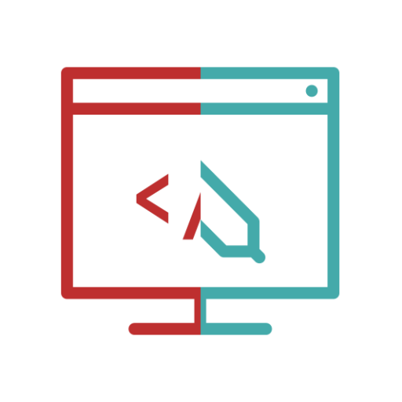

[__webdev and web_design__](https://discord.com/invite/keD8rZp)    \
Notable Channels: `#dev-help`, `#dev-chat`, `#app-feedback`,`#design`, `#user-experience`, `#html`, `#css`, `#javascript`, `#typescript`, `js-framework`, `#react`, `#vue`, `#php`, `#dot-net`, `#devops`, **[`so much more`](badges.md#so-much-more)** \
Language: English

[__The Coding Den__](https://discord.com/invite/code)  \
Notable Channels: `#general`, `#cil-and-runtime`, `#kotlin`,`#scala`, `#android`, `#ios`, `#nodejs`, `#ruby`, `#php`, `#web-frameworks`, `#algorithms`, `#regex`, `#systems-and-servers`, **[`so much more`](badges.md#so-much-more)** \
Language: English

[__Programming__](https://discord.com/invite/010z0Kw1A9ql5c1Qe)  \
Notable Channels: `#data-science`, `#graphics-programming`, `#dev-tools-and-ops`, `#unix-like`, `#web-dev`, `#security`, `#c-language`, `#java-jvm`, `#javascript`, `#odin-lang`, **[`so much more`](badges.md#so-much-more)** \
Language: English

[__The Odin Project__](https://discord.gg/V75WSQG)    \
Notable Channels: `#odin-general`, `#creations-showcase`, `#ubuntu-help`,`#tech-support-general`, `#virtualbox-help`, `#git-help`, `#html-css-help`, `#javascript-help`, `#nodejs-help`, `#rails-help`\
Language: English

[__Devcord__](https://discord.com/invite/devcord)    \
Notable Channels: `#javascript`, `#frontend`, `#backend`, `#php`, `#mobile`, `#design`, `#devops`, `#career`, `#code-review`, `#webtopic`, `#desktopic`, `#community-projects`, `#paid-work`\
Language: English

[__Garbage Collectors__](https://discord.com/invite/aJwTAgS)  \
Notable Channels: `#python exercises`, `#code feedback`, `#collaboration`, `#csharp`,`#java`, `#c and cpp`, `#web`, `#mobile`, `#security`, `#algos and ds`, `#networking`, `#resources`, `#machinelearning` \
Language: English

[__developlace.it__](https://discord.com/invite/Fprsyxz)  \
Notable Channels: `#projects`, `#web`, `#c_cpp`, `#c_sharp`,`#python`, `#jvm`, `#other`, `#pc_zone`, `#mobile_zone` \
Language: English, Polish

[__Code::Together__](https://discord.com/invite/ekgFE4s)   \
Notable Channels: `#looking-for-dev`, `#challenges`, `#python`, `#javascript`,`#c-family`, `#java`, `#html-css-web-js` `#dotnet`, `#databases`, `#hosting` \
Language: English

[__Programmers Palace__](https://discord.com/invite/48Zxcpy) \
Notable Channels: `#recruitment-hiring`, `#java`, `#python`, `#c_langs`,`#javascript`, `#lua`, `#web-dev`, `#php`, `#other-support` \
Language: English

### Competitive Programming

[__CP Community__](https://discord.com/invite/algorithms)    \
Notable Channels: `#beginner-questions`, `#general-cp`, `#problem-spoilers`, `#ioi`,`#icpc`, `#math`, `#errichto-yt`, `#vplanet` \
Language: English

## Art of Computer Science

Discussions on the concepts behind modern, and classical computing and its kin.

### Computer Science

[__Computer Science__](https://discord.com/invite/eF3Wjsd) \
Notable Channels: `#computer-science`, `#resources`, `#algorithms-and-data-structures`,`#theory-of-computation`, `#information-and-coding-theory`, `#cryptography`, `#artificial-intelligence` \
Language: English

[__cs50__](https://discord.com/invite/QYZQfZ6)  \
Notable Channels: `#lectures`, `#scratch`, `#hello`,`#mario`, `#cash`, `#credit`, `#readability`, `#caesar`, `#substitution`, `#plurality`, `#runoff`, `#tideman`, `#c-to-python-sentimental`, **[`so much more`](badges.md#so-much-more)** \
Language: English

### Mathematics

[__Mathematics__](https://discord.com/invite/BacbVax) \
Notable Channels: `#prealg-algebra`, `#calculus`, `#linear-algebra`,`#computing-software`, `#probability-statistics`, `#discrete-math`, `#abstract-algebra`, `#questions`, **[`so much more`](badges.md#so-much-more)** \
Language: English

### Physics

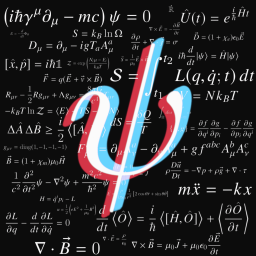

[__Physics__](https://discord.com/invite/N5jVwsg) \
Notable Channels: `#questions`, `#undergrad-physics`, `#graduate-physics` `#mathematical-physics`, `#astronomy-and-cosmology`, `#computational-physics`, `#engineering`, `#challenges` \
Language: English

### Other Sciences

| 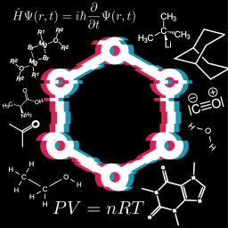 | 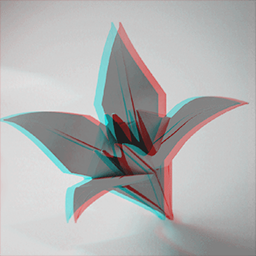 | 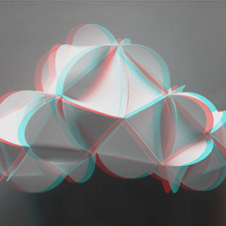 |
|----------------------|-------------------|---------------------|
| [__Biological Sciences__](https://discord.com/invite/QwSdffq)  | [__Chemistry__](https://discord.com/invite/eexdsFw)  | [__Climate Science__](https://discord.com/invite/YXvuN8X)  |

[__Homework Help__](https://discord.com/invite/YudDZtb)   \
Notable Channels: `#challenges`, `#math`, `#post-calculus` `#biology`, `#chemistry`, `#physics`, `#english`, `#social-science`, `#history`, `#computer-science`, `#studio-art`, **[`so much more`](badges.md#so-much-more)** \
Language: English

[__Science and Technology__](https://discord.com/invite/science)  \
Notable Channels: `#astronomy`, `#biology`, `#chemistry` `#engineering`, `#environment`, `#mathematics`, `#geometry`, `#calculus`, `#physics`, `#psychology`, `#technology`, **[`so much more`](badges.md#so-much-more)** \
Language: English

## Electricals

Discussions on bare-bones circuit boards, microprocessors, and bleeding edge hardware.  

### Engineering

[__Electrical Engineering__](https://discord.com/invite/W8v5EK2) \
Notable Channels: `#electrical-engineering`, `#questions`, `#computer-engineering` `#electronics-engineering`, `#power-engineering`, `#signal-controls`, `#mechanical-engineering`, `#robotics` \
Language: English

[__Aerospace & Mech Eng__](https://discord.com/invite/fYkvJNQ) \
Notable Channels: `#general-engineering`, `#events`, `#questions`, `#astronautics-aeronautics` `#thermo-fluids`, `#mechanics`, `#structural-analysis`, `#mechatronics`, `#design` \
Language: English

### Microprocessors and Microcontrollers

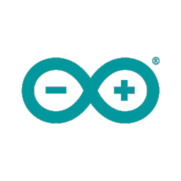

[__Arduino__](https://discord.gg/jQJFwW7)    \
Notable Channels: `#arduino-discussion`, `#product-help`, `#coding-help`, `#pcb-help`,`#adafruit-help`, `#show-off-your-ideas`, `#project-ideas` \
Language: English

[__Raspberry Pi__](https://discord.com/invite/bVVbSqQ) \
Notable Channels: `#tech-talk`, `#i-need-help`, `#python-dev`, `#projects-chat`,`#project-showcase`, `#show-off-your-ideas`, `#project-ideas` \
Language: English

### DIY

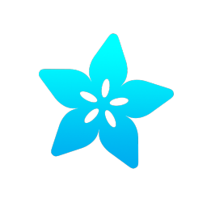

[__Adafruit__](https://discord.com/invite/5FBsBHU)    \
Notable Channels: `#circuitpython`, `#arduino`, `#3dprinting`, `#radio`,`#raspberry-pi`, `#wearables`, `#robotics`, `#help-with-projects`, `#iot`, `#events` \
Language: English

[__DIY Tech__](https://discord.com/invite/diytech)  \
Notable Channels: `#programming`, `#hardware-help`, `#software-help`,`#code-review`, `#project-showcase`, `#audio-tech`, `#retro-tech` \
Language: English

### Internet of Things

[__/r/Home Automation__](https://discord.com/invite/homeautomation)    \
Notable Channels: `#suggestions`, `#smartspeakers`, `#smarthub`, `#lighting`, `#security`, `#iot-dev`, `#buy-sell-trade` \
Language: English

[__r/HomeKit__](https://discord.com/invite/b2kTasd)   \
Notable Channels: `#general`, `#homekit-discussion`, `#hk-showcase`, `#hk-questions-help`, `#homepod-discussion`, `#hp-questions-help`, `#homebridge-discussion`, `#hb-plugin-showcase` \
Language: English

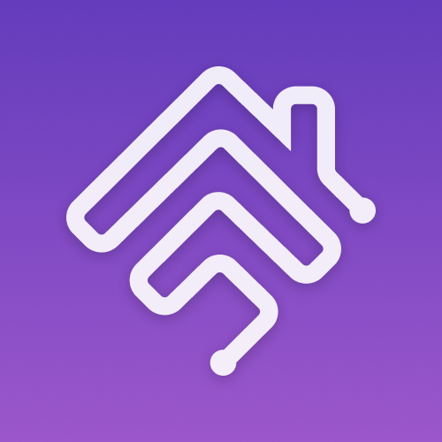

[__Homebridge__](https://discord.com/invite/Z8jmyvb)    \
Notable Channels: `#general`, `#homekit`, `#ui`, `#config`, `#raspberry-pi`, `#raspbian-image`, `#macos`, `#bwindows`, `#docker`, `#verified-plugins`, `#plugins`, `#homebridge-beta-testing`, `#plugin-development` \
Language: English

[__Home Assistant__](https://discord.com/invite/c5DvZ4e)    \
Notable Channels: `#homeassistant`, `#support`, `#automations`, `#frontend`, `#devices`, `#templates`, `#add-ons`, `#apps`, `#cameras`, `#diy`, `#node-red`, `#voice-assistants`, `#zigbee`, `#development` \
Language: English

### Hardware

[__PC MASTER RACE__](https://discord.com/invite/pcmr)    \
Notable Channels: `#build-help`, `#tech-support`, `#overclocking`, `#programming`, `#linux`, `#mac-os`, `#content-sharing` \
Language: English

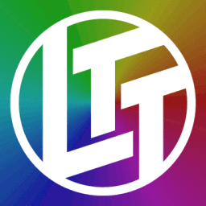

[__LTT Official__](https://discord.com/invite/ltt)   \
Notable Channels: `#tech-chat`, `#tech-support`, `#my-rig`, `#overcloaking`, `#creative`, `#development`, `#crypto-currency`, `#networking`, `#audio`, `#vr` \
Language: English

[__Monitor Enthusiasts__](https://discord.com/invite/MZwg5cQ)    \
Notable Channels: `#monitors-discussion`, `#ultrawide-discussion`, `#mounts-and-desks`, `#help`, `#setups-and-battlestations` \
Language: English

[__Electronics Repair School__](https://discord.com/invite/6zQWaTN)    \
Notable Channels: `#projects`, `#tools-and-parts`, `#automative`, `#laptops`, `#phones`, `#tablets`, `#consoles`, `#tv-monitor`, `#batteries`, `#diy-arduino-pi` \
Language: English

## Programming Languages

Programming languages used in embedded systems, web frameworks, automation and mobile apps.

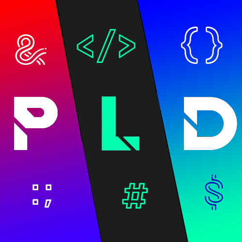

[__Programming Language Development__](https://discord.com/invite/HDyqM2n) \
Notable Channels: `#langdev`, `#programming`, `#projects`, `#resources` \
Language: English \
 

### Language Paradigms

[__Functional Programming__](https://discord.com/invite/K6XHBSh)  \
Notable Channels: `#haskell`, `#tooling`, `#lisp-beginners`, `#clojure`, `#dependent-types`, `#agda`, `#coq`, `#idris` `#compilers`, `#scala`, `#elm`, `#f-sharp`, `#elixir`, `#purescript`, `#type-theory` \
Language: English   

[__Low-Level Programming__](https://discord.com/invite/5ssDFZS) \
Notable Channels: `#rust`, `#assembly`, `#c-lang`, `#c-cpp`, `#wasm`, `#compilers`, `#embedded`, `#game-dev`, `#hardware` `#linux`, `#os-development` \
Language: English

### Assembly

[__Assemblers Assemble__](https://discord.com/invite/Km5VzKj) \
Notable Channels: `#x86`, `#arm`, `#z80`, `#6502`, `#jvm`, `#mips`, `#m68k`, `#brainfu*k`, `#nand-nor`, `#other` \
Language: English \
 

### C and C++

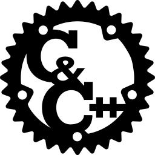

[__Together C & C++__](https://discord.com/invite/vnyVmAE)  \
Notable Channels: `#c_general`, `#cpp_general`, `#assembly`, `#code_review`, `#gamedev`, `#graphics`, `#audio`, `#programming_environment`, `#collaboration`, `#unix`, `#other_langs_help`, `#math` \
Language: English

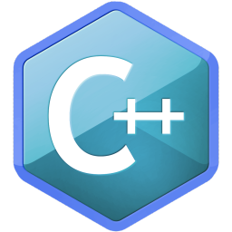

[__C++ Help__](https://discord.com/invite/J5hBe8F)  \
Notable Channels: `#cpp-questions`, `#help`, `#advanced`, `#gamedev`, `#project-showcase` \
Language: English \
 

[__#include__](https://discord.gg/ZPErMGW)   \
Notable Channels: `#assembly`, `#c`, `#gpu`, `#audio`, `#build-systems`, `#cpp`, `#embedded`, `#learning`, `#security` `#conferences`, `#tooling`, `#2d-graphics`, `#clion`, `#catch2`, `#qt` \
Language: English

### C#

[__C#__](https://discord.com/invite/csharp)   \
Notable Channels: `#general_csharp`, `#beginner_questions`, `#projects`, `#code-review`, `#career-talk`, `#web`, `#gui`, `#game-dev`, `#database`, `#architecture-and-tooling`, **[`so much more`](badges.md#so-much-more)** \
Language: English

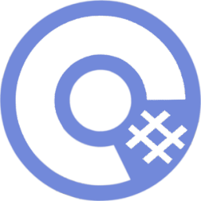

[__C# Inn__](https://discord.gg/rCMKcUU)  \
Notable Channels: `#projects`, `#mentors`, `#learning-discussion`, `#questions`, `#architecture`, `#code-review`, `#web`, `#python`, `#ui-ux` \
Language: English

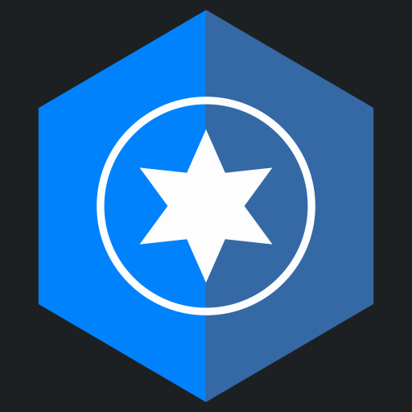

[__opentk__](https://discord.com/invite/6HqD48s)    \
Notable Channels: `#general`, `#support`, `#development`, `#showcase`, `#showcase-discussion` \
Language: English \
 

### Clojure

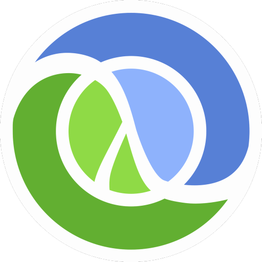

[__Clojurians__](https://discord.com/invite/v9QMy9D) \
Notable Channels: `#general`, `#clojure`, `#clojurescript`, `#emacs`, `#editors`, `#interop-therapy`, `#boot`\
Language: English \
 

### CSS 

[__Tailwind CSS__](https://discord.com/invite/7NF8GNe)    \
Notable Channels: `#help`, `#tailwind-css`, `#core-dev`, `#plugins`, `#docs`, `#tailwind-ui`, `#design`, `#development`, `#showcase` \
Language: English 

[__cascading-style-sheets__](https://discord.gg/92yyRb2) \
Notable Channels: `#new-to-css`, `#intermediate-users`, `#blog-posts`, `#less`, `#sass`, `#scss`, `#native-css-feature`, `#tailwind`\
Language: English

### Elixir

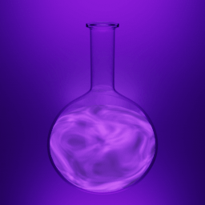

[__Elixir Language__](https://discord.com/invite/elixir)\
Notable Channels: `#elixir`, `#erlang`, `#nerves`, `#phoenix`, `#absinthe`, `#alchemy`, `#frontend`\
Language: English \
 

### Go

[__Discord Gophers__](https://discord.com/invite/PxwHvBS) \
Notable Channels: `#golang`, `#job-market-only`, `#go-art-only`, `#go-news-only`, `#discordgo`, `#disgord`, `#dca`, `#arikawa`\
Language: English

### Haxe

[__Haxe__](https://discord.com/invite/0uEuWH3spjck73Lo)    \
Notable Channels: `#general`, `#show-your-work`, `#tools`, `#flixel`, `#heaps`, `#kha`, `#nme`, `#haxepunk`, `#react`, `#haxe-ui`, `#lix`, `#coconut` \
Language: English

### Java

[__Together Java__](https://discord.gg/hVtnwGd)  \
Notable Channels: `#geek-speak`, `#java-help`, `#android-help`, `#framework-help`, `#c_cpp_help`, `#algorithms_help`, `#architecture-help`, `#code_review`, `#ui_ux_help`\
Language: English

### JavaScript

[__SpeakJS__](https://discord.com/invite/dAF4F28) \
Notable Channels: `#collaboration`, `#code-review`, `#help`, `#react`, `#angular`, `#vue`, `#svelte`, `#jquery`, `#gatsby`, `#node`, `#graphql`, `#electron`, `#threejs`, `#webgl`\
Language: English

[__ReasonML__](https://discord.com/invite/reasonml)    \
Notable Channels: `#general`, `#reasonconf`, `#native-development`, `#bucklescript`, `#job-openings`, `#react`, `#ocaml`, `#reason-dojo`, `#reason-core-dev`\
Language: English

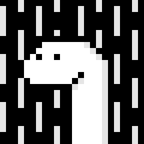

[__Deno__](https://discord.com/invite/deno)    \
Notable Channels: `#general`, `#showcase`, `#help`, `#dev`, `#rust-libs` \
Language: English \
 

#### JavaScript Web Frameworks

[__emberjs__](https://discord.gg/emberjs)    \
Notable Channels: `#ember-jobs`, `#help`, `#ember-clie`, `#ember-data`, `#topic-a11y`, `#topic-addon-development`, `#topic-backend`, `#dev-meta`, `#dev-ember-learning`, `#ember-addons`, **[`so much more`](badges.md#so-much-more)** \
Language: English, français, Deutsch, português, pусский, español 

[__Docusaurus__](https://discord.com/invite/docusaurus)    \
Notable Channels: `#docusaurus-users`, `#docusaurus-dev`, `#docusaurus-2-dogfooding`, `#docusaurus-2-dev`, `#docusaurus-zeit`, `#docusaurus-algolia`, `#docusaurus-1-to-2-migration` \
Language: English

#### Node.js

[__Nodeiflux__](https://discord.com/invite/vUsrbjd)    \
Notable Channels: `#general`, `#need-help`, `#i-made-this`, `#news-and-links`, `#libraries`, `#ops`, `#react`, `#jobs` \
Language: English

|  | 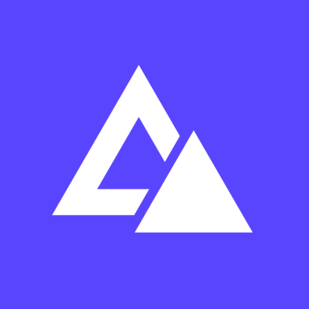
|----------------------|-------------------|
| [__NestJS__](https://discord.com/invite/G7Qnnhy)    | [__AdonisJS Framework__](https://discord.com/invite/vDcEjq6)    |

#### ReactJS 

[__Reactiflux__](https://discord.gg/reactiflux)    \
Notable Channels: Notable Channels: `#help-react`, `#react-native`, `#js`, `#styling`, `#backend`, `#graphql`, `#code-review`, `#react-router`, `#redux`, `#react-bootstrap`, `#formik`, **[`so much more`](badges.md#so-much-more)** \
Language: English

|  | 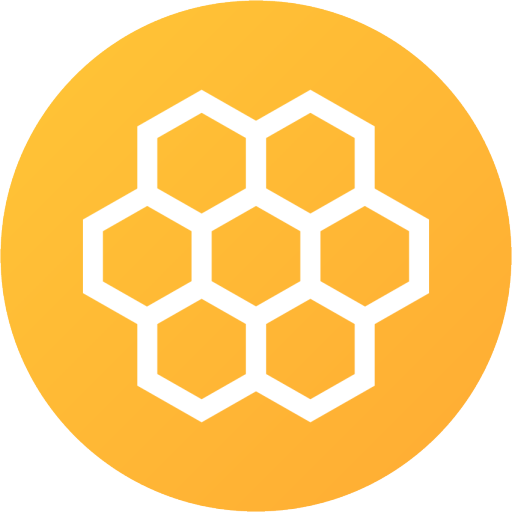 |
|----------------------|-------------------|
| [__Gatsby__](https://discord.gg/gatsby)    | [__Invertase OSS__](https://discord.com/invite/C9aK28N)   

#### Vue.js

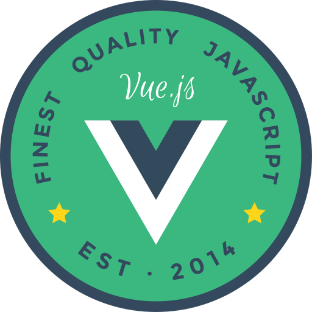

[__Vue Land__](https://discord.com/invite/HBherRA)  \
Notable Channels: `#vuex-store`, `#vue-router`, `#code-help`, `#vue-cli`, `#vue-i18n`, `#vuepress`, `#composition-api`, `#vue3-discussions`, `#vue2-internals`, `#vue-testing`, **[`so much more`](badges.md#so-much-more)** \
Language: English, Deutsch, français, 汉语, español, 日本語, dansk, 한국어, português, polski, русский

| 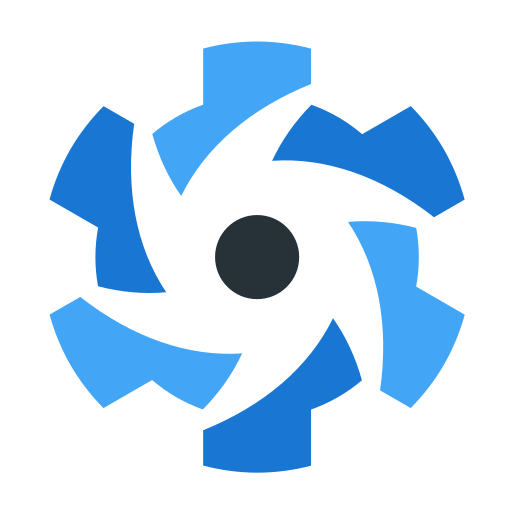 | 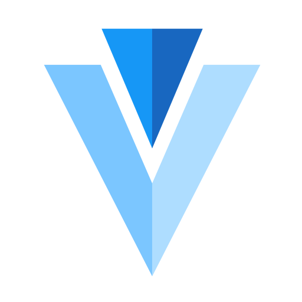 | 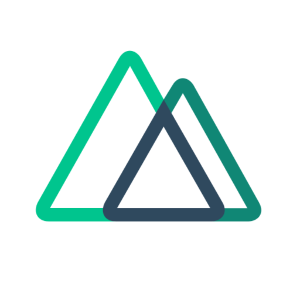 |  | 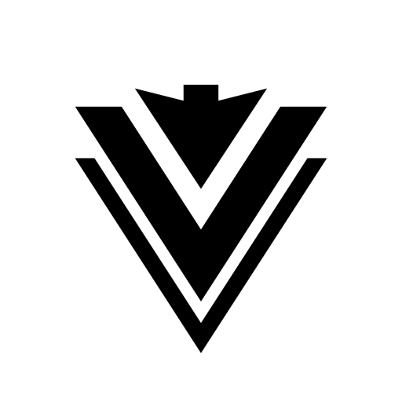 |  |  |
|----------------------|-------------------|-------------------|-------------------|-------------------|-------------------|-------------------|
| [__Quasar Framework__](https://discord.com/invite/5TDhbDg)    | [__Vuetify__](https://discord.com/invite/s93b7Fv)    | [__Nuxt.js__](https://discord.com/invite/b3dvQ9b)    | [__Gridsome__](https://discord.com/invite/daeay6n)    | [__Vuesax__](https://discord.com/invite/2kHwpfe)    | [__Vue Material__](https://discord.com/invite/vuematerial)    | [__Buefy__](https://discord.com/invite/ZkdFJMr)    |

#### Other JavaScript Libraries

[__storybook__](https://discord.gg/UUt2PJb)    \
Notable Channels: `#general`, `#support`, `#maintenance`, `#design`, `#presets`, `#documentation`, `#addons`, `#jobs`, `#frameworks`\
Language: English

[__yarnpkg__](https://discord.com/invite/yarnpkg)    \
Notable Channels: `#contributing`, `#prs`, `#issues`, `#support`, `#general`\
Language: English \
 

[__EGOIST OSS__](https://discord.com/invite/2t5mdCz)    \
Notable Channels: `#ream`, `#saber`, `#poi`, `#cac`, `#bili`, `#sao`, `#codepan`, `#docup`\
Language: English \
 

### Lisp

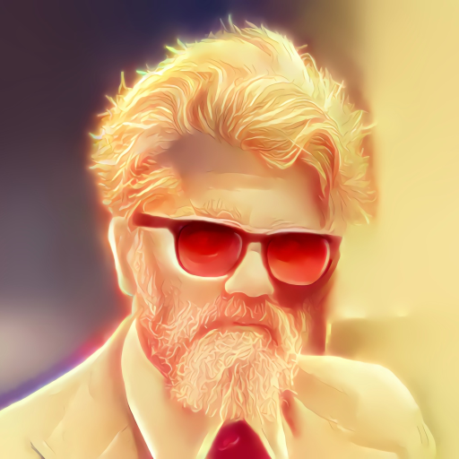

[__Lisp__](https://discord.com/invite/hhk46CE) \
Notable Channels: `#clojure`, `#common-lisp`, `#emacs-lisp`, `#racket`, `#scheme`, `#lisp-gamedev`, `#beginner-questions`, `#algorithms`, `#compiler-theory`\
Language: English

### Lua

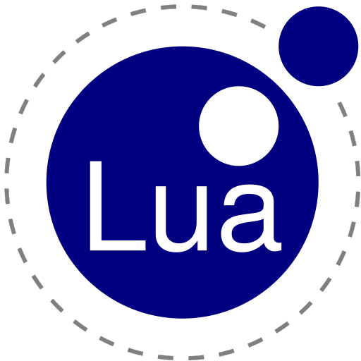

[__Lua Scripters__](https://discord.com/invite/7wu7ZsW) \
Notable Channels: `#scripting`, `#creations`, `#roblox`, `#gmod`, `#wow`, `#fivem`, `#luajit`, `#lua-c`, `#terra`\
Language: English

[__Luvit.io__](https://discord.com/invite/luvit)   \
Notable Channels: `#general`, `#lua`, `#luvit`, `#luvi`, `#luv`, `#lit` \
Language: English \
 

### PHP

[__Laravel__](https://discord.com/invite/mPZNm7A)    \
Notable Channels: `#general`, `#cashier`, `#envoyer`, `#forge`, `#help`, `#homestead`, `#horizon`, `#hype`, `#internals`, `#lumen`, `#meetups`, `#nova`, `#passport`, `#jobs`\
Language: English

[__Flarum__](https://discord.com/invite/3fnPSjA)    \
Notable Channels: `#chitchat`, `#support`, `#extensions`, `#extend`, `#internals`, `#docs`\
Language: English \
 

[__Tenancy__](https://discord.com/invite/4amsQJ7)    \
Notable Channels: `#brewery`, `#coding`, `#support`, `#internals`, `#multi-tenant-support`\
Language: English \
 

### Python

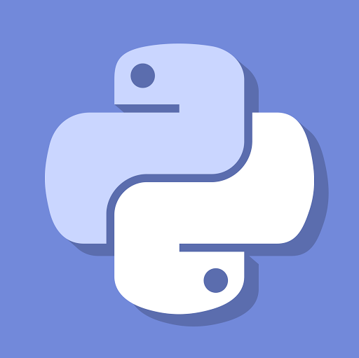

[__Python__](https://discord.com/invite/python)   \
Notable Channels: `#python-discussion`, `#careers`, `#help`, `#async`, `#computer-science`, `#database`, `#data-science`, `#dev-ops`, `#discord-py`, `#game-development`, `#security`, **[`so much more`](badges.md#so-much-more)** \
Language: English

[__Pallets Project__](https://discord.gg/t6rrQZH)    \
Notable Channels: `#watercooler`, `#get-help`, `#sprint`, `#flask`, `#jinja`, `#click`, `#werkzeug`, `#flask-sqlalchemy`, `#flask-rebar`, `#wtforms`\
Language: English

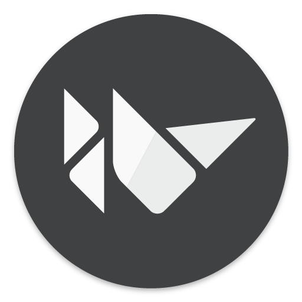

[__Kivy__](https://discord.com/invite/djPtTRJ)    \
Notable Channels: `#general`, `#support`, `#your-projects`, `#dev`, `#python-for-android`\
Language: English \
 

### Ruby

[__Ruby__](https://discord.com/invite/KpcVgPc) \
Notable Channels: `#beginners-chat`, `#project-ideas`, `#help`, `#devops`, `#code-review`, `#frontend`, `#backend`, `#rails`, `#sinatra`\
Language: English

### Rust

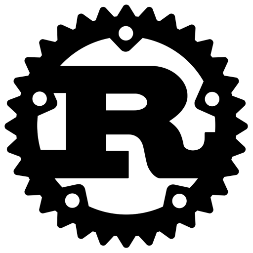

[__The Rust Programming Language__](https://discord.com/invite/rust-lang)    \
Notable Channels: `#beginners`, `#contribute`, `#community-team`, `#rustbridge`, `#design`, `#compiler`, `#wg-grammar`, `#wg-async-foundation`, `#type-theory`, `#wg-wasm`, `#wg-gamedev`, **[`so much more`](badges.md#so-much-more)** \
Language: English

[__Rust Programming Language Community Server__](https://discord.com/invite/aVESxV8)  \
Notable Channels: `#beginners`, `#code-review`, `#dev-tools`, `#black-magic`, `#macros`, `#async`, `#crypto-and-security`, `#games-and-graphics`, `#lang-dev`, `#net-and-web`, `#os-dev`\
Language: English

### Swift

[__Swift__](https://discord.com/invite/0uZpB8GgRvoU12Ta) \
Notable Channels: `#wwdc`, `#general`, `#swift`, `#swiftui`, `#firebase`, `#xcode`, `#general-ios`, `#general-macos`, `#general-watchos`, `#interview`\
Language: English

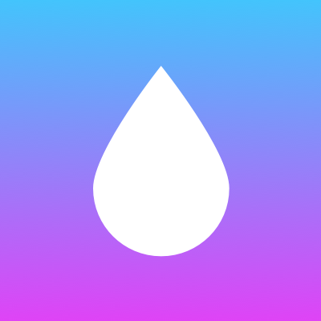

[__VAPOR__](https://discord.com/invite/vapor)    \
Notable Channels: `#vapor`, `#leaf`, `#fluent`, `#auth`, `#async`, `#security`, `#meetups`, `#showcase`, `#today-i-learned`, `#apple-events`, `#deployment`, `#red`, `#cloud`, `#aws`, `swift`, **[`so much more`](badges.md#so-much-more)**` \
Language: English, čeština, español, русский, Deutsch, 中文频道, Nederlands, 日本語, français, italiano, українська-мова, 한국어

### Typescript

[__TypeScript Community__](https://discord.com/invite/typescript)    \
Notable Channels: `#ts-discussion`, `#help`, `#vue`, `#angular`, `#react`, `#language-design`, `#compiler`, `#architecture`, `#tooling`, `#devops`, `#site-localization`, `#deno`, `#meetups`, `#projects` \
Language: English

## Design and Illustrations
All about design systems, graphical illustrations, user interface and user experience.

[__The Spot__](https://discord.gg/uz8JDW9)   \
Notable Channels: `#the-spotlight`, `#discussions`, `#critique`, `#showcase`, `#tech-help`, `#resources`, `#inspiration`, `#traditional`, `#illustration`, `#photography` \
Language: English

[__The Design Collective__](https://discord.com/invite/zM5pgrc)  \
Notable Channels: `#challenge`, `#design`, `#illustration`, `#ui-ux`, `#photo-film`, `#animation`, `#dev`, `#3d`, `#general-one`, `#client-area`, `#collab` \
Language: English

[__Adobe Systems Community__](https://discord.gg/Aak7YGU) \
Notable Channels: `#work-in-progress-critique`, `#photoshop`, `#premiere-pro`, `#after-effects`, `#illustrator`, `#animate`, `#indesign`, `#xd`, `#lightroom`, `#other-programs` \
Language: English

## Operating Systems

The underlying kernels that are responsible for managing application processes. 

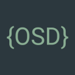

[__Operating System Development__](https://discord.com/invite/RnCtsqD) \
Notable Channels: `#osdev`, `#programming`, `#beginner`, `#bootloader-dev`, `#wiki`, `#projects`, `#resources` \
Language: English

### Android

[__/r/AndroidDev__](https://discord.gg/D2cNrqX)   \
Notable Channels: `#beginner`, `#intermediate`, `#rom`, `#general`, `#flutter`, `#kotlin`, `#firebase`, `#dependency-injection`, `#rx`, `#design` \
Language: English

[__/r/FlutterDev__](https://discord.com/invite/N7Yshp4)   \
Notable Channels: `#beginner`, `#intermediate`, `#general`, `#android`, `#ios`, `#web`, `#desktop`, `#app-showcase`, `#hiring` \
Language: English

[__XDA-Developers__](https://discord.com/invite/EhaMzy2)    \
Notable Channels: `#general-tech`, `#help`, `#development`, `#theming`, `#devices`, `#google-general`, `#huawei-general`, `#oneplus-general`, `#samsung-general`, `#nokia-general` \
Language: English

[__Android Discord__](https://discord.com/invite/android)   \
Notable Channels: `#android`, `#whatphone`, `#tech-support`, `#phone-questions`, `#themes`, `#phonetography` \
Language: English

[__/r/AndroidRoot__](https://discord.gg/Uq7r6kF)   \
Notable Channels: `#root`, `#custom-roms`, `#theming`, `#development`, `#magisk`, `#twrp`, `#substratum`, `#support-room` \
Language: English

### Apple Systems

[__Apple Betas__](https://discord.com/invite/beta)    \
Notable Channels: `#releases`, `#general`, `#ios`, `#ipados`, `#macos`, `#watchos`, `#tvos`, `#xcode`, `#development` \
Language: English

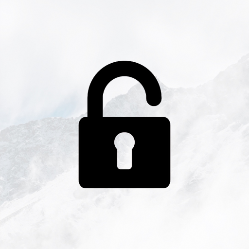

[__r/Jailbreak__](https://discord.com/invite/jb)    \
Notable Channels: `#showcase`, `#common-issues`, `#jailbreak`, `#general`, `#themes`, `#legacy`, `#unc0ver`, `#tvos-jailbreaks`, `#checkra1n`, `#chimera`, `#flex`, `#ncontrol`, `#support` \
Language: English

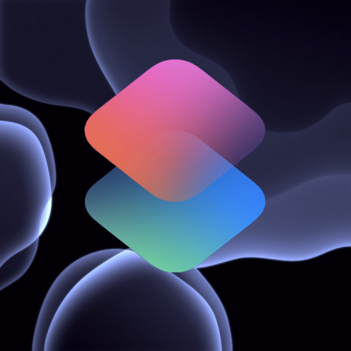

[__Shortcuts__](https://discord.gg/HrzAhUu)   \
Notable Channels: `#general`, `#shorcut-sharing`, `#help-and-support`, `#shortcast-info`, `#shortcasts-content-suggestions`\
Language: English

### Windows

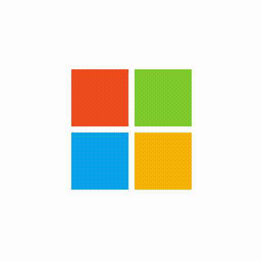

[__Microsoft Community__](https://discord.com/invite/microsoft)   \
Notable Channels: `#general-chat`, `#insiders-chat`, `#tech-support`, `#purchase-advice`, `#development`, `#it-pros`, `#servers`, `#surface`, `#office`, `#unix` \
Language: English

### Linux

[__r/unixporn__](https://discord.com/invite/TnJ4h5K)    \
Notable Channels: `#showcase`, `#ricing-theming`, `#tools`, `#wallpapers`, `#tech-support`, `#programming`, `#hardware` \
Language: English

#### Linux in General

[__Discord Linux__](https://discord.com/invite/discord-linux)  \
Notable Channels: `#tech`, `#customization`, `#programming`, `#support-linux`, `#support-distro-installs`, `#support-games`, `#support-discord`, `#support-non-linux` \
Language: English

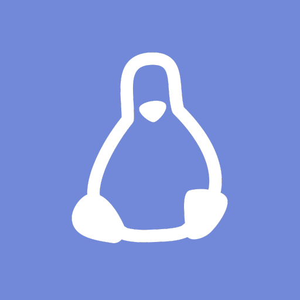

[__Linux For All__](https://discord.gg/gewCYyN)  \
Notable Channels: `#linux-news`, `#general`, `#linux`, `#gaming`, `#suggestions`, `#developers`, `#themes`, `#support` \
Language: English

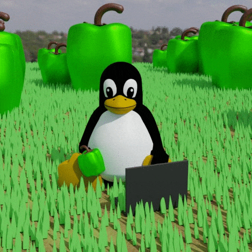

[__*nix nest__](https://discord.gg/shpxu6T)  \
Notable Channels: `#home`, `#dev-random`, `#support`, `#unixporn`, `#programming`, `#media`, `#hardware`, `#gaming` \
Language: English

#### Linux Distributions

[__Ubuntu Hideout__](https://discord.com/invite/jcwJEJH)  \
Notable Channels: `#tech-talk`, `#coding-cave`, `#system-installation`, `#software-installation,` `#desktop-environment`, `#hardware-drivers`, `#networking`, `#programming` \
Language: English

[__Fedora Linux__](https://discord.com/invite/Fedora)    \
Notable Channels: `#home`, `#man-pages`, `#silverblue-containers`, `#server-rhel-centos`, `#arm-raspberry`, `#showcase`, `#gaming-general`, `#hardware-for-linux` \
Language: English

[__Gentoo Linux__](https://discord.com/invite/Gentoo)    \
Notable Channels: `#chat`, `#support`, `#screenshots`, `#general-development`, `#ebuilds`, `#resources`, `#containers` \
Language: English, 日本語

[__openSUSE__](https://discord.com/invite/openSUSE)    \
Notable Channels: `#support`, `#chat`, `#project`, `#packaging`, `#factory`, `#admin`, `#artwork`, `#docs`, `#gnome`, `#xfce` \
Language: English, français, Deutsch, italiano, polski, español, Nederlands

[__Manjaro Linux__](https://discord.com/invite/t6GJuTC) \
Notable Channels: `#kde`, `#xfce`, `#gnome`, `#manjaro-arm`, `#help-general`, `#help-installation`, `#programming`, `#customizations` \
Language: English

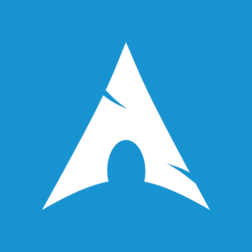

[__Arch Linux [unofficial]__](https://discord.com/invite/MrhPdhn) \
Notable Channels: `#news`, `#home`, `#arch-support`, `#other-distros`, `#programming`, `#ricing`, `#wallpapers` \
Language: English

[__Linux Mint Community__](https://discord.com/invite/EVVtPpw)  \
Notable Channels: `#support-mint`, `#support-lmde`, `#support-other-os`, `#support-nos`, `#general`, `#tech-talk`, `#user-created-content` \
Language: English

#### Gaming on Linux

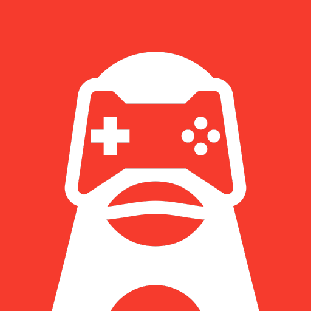

[__Linux Gaming__](https://discord.com/invite/t6GJuTC) \
Notable Channels: `#support-general`, `#support-hardware`, `#support-gaming`, `#new-to-linux`, `#tech-general`, `#coding`, `#unixporn`, `#original-content` \
Language: English

[__Lutris__](https://discord.gg/Pnt5CuY) \
Notable Channels: `#news`, `#general`, `#irc`, `#requests_and_feedback`, `#lutris_support`, `#linux_support`, `#installer_creation` \
Language: English

[__ProtonDB Official Server__](https://discord.com/invite/uuwK9EV)    \
Notable Channels: `#protondb-website`, `#proton-game-support`, `#proton`, `#linux`, `#linux-support`, `#general-game-support` \
Language: English

### Other OS

[__r/ChromeOS__](https://discord.com/invite/T7AMQUM)   \
Notable Channels: `#chromeos`, `#chromium`, `#crostini`, `#purchase-advice`, `#dev-mode`, `#enterprise`, `#android`, `#gaming`, `#support`\
Language: English

## Server-side

Server dwellers, discussions on network management and infrastructure, IT homelab, containers, APIs, Kubernetes and applications that run on them.

[__/r/sysadmin__](https://discord.com/invite/sysadmin)   \
Notable Channels: `#sysadmin`, `#help`, `#security`, `#scripting`, `#microsoft`, `#linux`, `#career-advice`, `#networking` \
Language: English

[__Amazon Web Services (AWS Cloud)__](https://discord.com/invite/vG7nVX5) \
Notable Channels: `#general-aws`, `#aws-rage`, `#ask-for-technical-help`, `#cloud-automation`, `#cloud-security`, `#getting-hired` \
Language: English

[__Data Engineering__](https://discord.com/invite/2pER6dq) \
Notable Channels: `#general`, `#show`, `#help`, `#career`, `#data-science` `#resources`, `#architecture`, `#cloud`, `#databases`, `#etl-workflow` \
Language: English

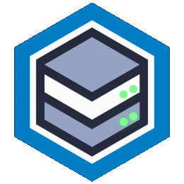

[__Homelab__](https://discord.com/invite/homelab)   \
Notable Channels: `#general`, `#labpics`, `#homelabquotes`, `#code` \
Language: English, Deutsch, français, Nederlands \
 

### API

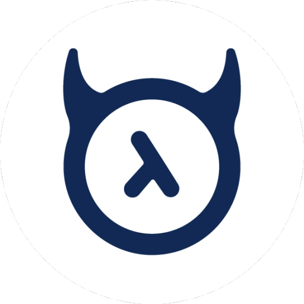

[__HasuraHQ__](https://discord.com/invite/hasura)    \
Notable Channels: `#graphql-engine`, `#new-to-graphql`, `#contrib`, `#look-what-i-built`, `#preview`, `#3factor-apps`, `#deployment-help` \
Language: English

### Containers

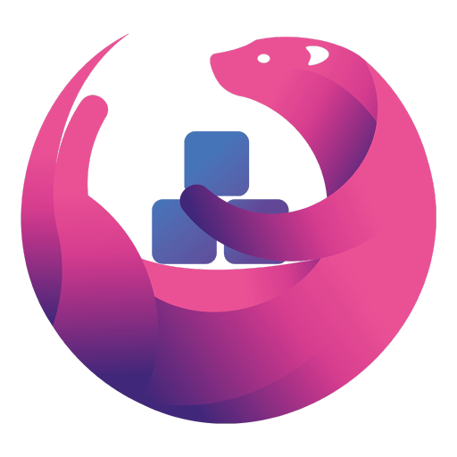

[__Linuxserver.io__](https://discord.com/invite/YWrKVTn)    \
Notable Channels: `#general-support`, `#docker-support`, `#heimdall`, `#linux-chat`, `#other-support`, `#hardware` \
Language: English

### Server-side Applications

|  | 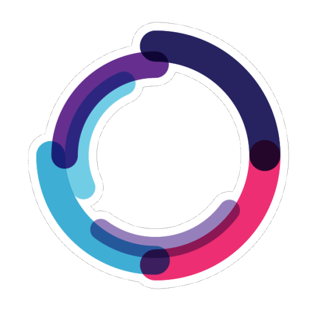 |  |  | 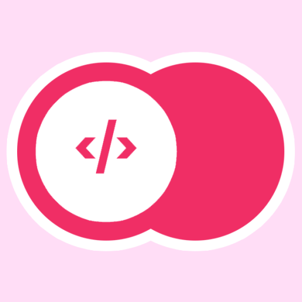 |
|----------------------|-------------------|-------------------|-------------------|-------------------|
| [__/r/Plex__](https://discord.com/invite/plex)   | [__Organizr__](https://discord.com/invite/TrNtY7N)    | [__LibreNMS__](https://discord.com/invite/librenms)    | [__SpaceUpTech__](https://discord.com/invite/RkGjW93)    | [__Appwrite__](https://discord.com/invite/GSeTUeA)    |

## Computer Security

Everything red and blue teams are leaglly allowed to do; securty asssessment, reverse engineering, loopholes in networks, vulnerability research and so on.

[__Reverse Engineering__](https://discord.gg/PSfAu8N)  \
Notable Channels: `#help`, `#ctf`, `#starting-out`, `#mobile`, `#exploits-and-vulns`, `#hardware`, `#malware`, `#tools`, `#software-protections` \
Language: English

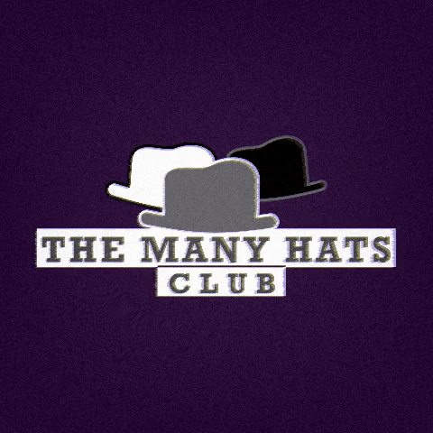

[__The Many Hats Club__](https://discord.gg/infosec)    \
Notable Channels: `#infosec-general`, `#technical-chat`, `#student-zone`, `#blue-team-zone`, `#ctf`, `#malware-phishing`, `#cyber-threat-intel`, `#digital-forensica` \
Language: English

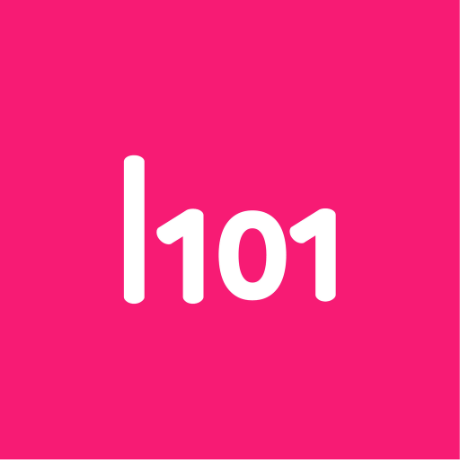

[__Hacker101__](https://discord.com/invite/32ZNZVN)    \
Notable Channels: `#general`, `#hacking-resources`, `#questions-and-answers`, `#hacktivity`, `#hackthebox`, `#mother-ctfs`, `#h1-2006-ctf`, `#ctfs`, `#a-little-something-to-get-you-started` \
Language: English

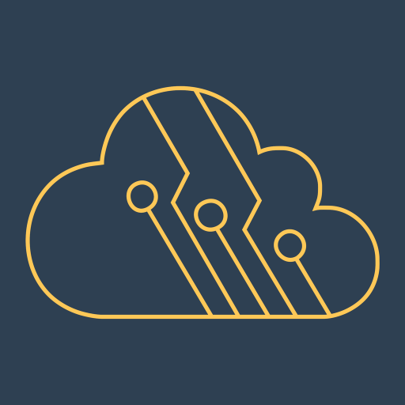

[__CyberSecLabs Lounge__](https://discord.com/invite/2C9dmtg)  \
Notable Channels: `#support-labs`, `#challenge-labs`, `#ctf`, `#technical-help`, `#red-teaming`, `#networking`, `#cryptography`, `#programming` \
Language: English

[__The Cyber Mentor__](https://discord.com/invite/Nu59kq5)  \
Notable Channels: `#web-app-course`, `#zero-to-hero`, `#red-teaming`, `#reverse-engineering`, `#linux`, `#web-apps`, `#htb`, `#tryhackme`, `#forensics`, `#job-postings` \
Language: English

[__3D's CyberSec Empire__](https://discord.com/invite/V5Axpyj) \
Notable Channels: `#ethical-hacking`, `#questions`, `#sources`, `#projects`, `#security-softwares`, `#capture-the-flag`, `#other-programming-languages` \
Language: English

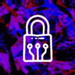

[__LOCKE__](https://discord.com/invite/n8TSaNf) \
Notable Channels: `#windows-os`, `#unix-family`, `#mac-os`, `#ethical-hacking`, `#ctf-discussion`, `#job-discussion`, `#networking`, `#cryptography`, `#mobile-devices`, `#web-dev`, `#python` \
Language: English

[__InfoSec & Coding__](https://discord.gg/zSaDzRW) \
Notable Channels: `#general`, `#questions`, `#programming`, `#hacking`, `#webdev`, `#opearting-systems`, `#ctf`, `#resources` \
Language: English

[__Whitehat Hacking__](https://discord.com/invite/beczNYP) \
Notable Channels: `#cyber-news`, `#hacking`, `#mac-os`, `#windows`, `#linux`, `#ios`, `#android`, `#hardware`, `#coding`, `#malware-analysis`, `#training`, `#c-re-arm-x86-help` \
Language: English

## Blockchain and Cryptocurrency

The open-source development of cryptocurrencies and applications of blockchain.

[__CryptoDevs__](https://discord.com/invite/EDA6M3R)   \
Notable Channels: `#core-crypto-dev`, `#layer-2-dev`, `#any-dev`, `#eth-dev`, `#web3-dev`, `#solidity-dev`, `#vyper-dev`, `#evm-dev`, `#tools-and-resources`, `#events`, `#jobs`, `#bounties`, `#contribute` \
Language: English

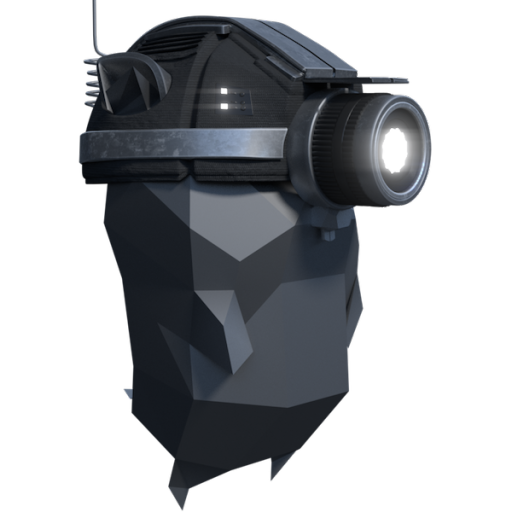

[__Go Ethereum__](https://discord.com/invite/nthXNEv)    \
Notable Channels: `#general`, `#light-client`, `#abigen`, `#clef`, `#puppeth`, `#rinkeboy`, `#progpow`, `#firefly`, `#devp2p`, `#mobile` \
Language: English

### Currencies

|  |  |  |  | 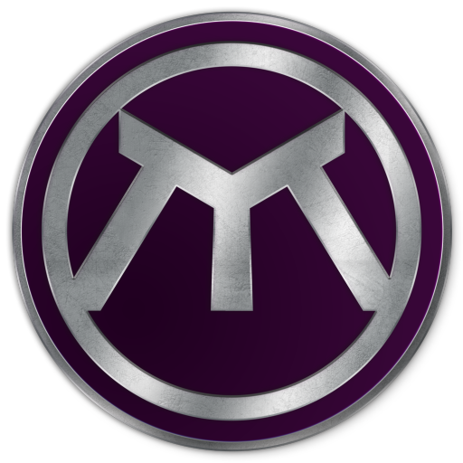 | 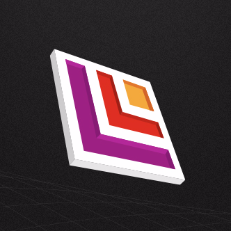 |  |
|----------------------|-------------------|-------------------|-------------------|-------------------|-------------------|-------------------|
| [__EtherGem  / EGEM & SFRX__](https://discord.com/invite/zav3EkW)    | [__Vertcoin - Official__](https://discord.com/invite/vertcoin)    | [__Nano__](https://discord.com/invite/xjMV7j)    | [__Groestlcoin__](https://discord.com/invite/vCKxQBz)    | [__Metrix Market__](https://discord.com/invite/5nwrTwJ)    | [__Akroma Official__](https://discord.com/invite/KWC8wtT)    | [__Cardano Community__](https://discord.com/invite/TUr9RDU)    |

## Game Development

Making of games, how to rasterize or real time ray tracing, the complexities behind each object movement, everything before publishing in the marketplace.

[__Game Dev League__](https://discord.com/invite/gamedev)  \
Notable Channels: `#events`, `#unity`, `#unreal-engine`, `#gamemaker-studio`, `#open-source`, `#löve-dev`, `#monogame-and-libgdx-dev`, `#godot`, `#web-dev`, `#cryengine-dev`, `#vr-dev`, **[`so much more`](badges.md#so-much-more)** \
Language: English

[__Reddit /r/gamedev__](https://discord.com/invite/reddit-gamedev)    \
Notable Channels: `#gamedev-general`, `#show-off-your-stuff`, `#unity`, `#unreal`, `#godot`, `#lhtml5-javascript`, `#c-cpp-csharp-java`, `#opengl-vulkan`, `#gamemaker`, `#retro`, `#audio`, `#visuals`, `#jobs` \
Language: English

[__Game Dev Network__](https://discord.com/invite/gdn)   \
Notable Channels: `#gamedev-talk`, `#career-advice`, `#gamejam`, `#work-in-progress`, `#unity`, `#unreal`, `#godot`, `#gamemaker`, `#stride-xenko`, `#roblox`, `#ui-ux`, `#3d-modeling`, `#sound`, `#looking-for-work` \
Language: English

[__osu!dev__](https://discord.com/invite/ppy)   \
Notable Channels: `#osu-lazer`, `#osu-framework`, `#osu-dev`, `#difficulty-osu`, `#difficulty-taiko`, `#difficulty-catch`, `#difficulty-mania`, `#osu-wiki`, `#modding`, `#mappers-guild` \
Language: English

### Game Design

[__TTRPG Design and Playtesting__](https://discord.com/invite/5XRWTj9)   \
Notable Channels: `#business`, `#game-design`, `#math`, `#mechanics`, `#playtesting`, `#visual-design`, `#world-design`, `#writing`, `#game-critique`, `#mechanics-critique`, `#projects` \
Language: English

[__/r/GameDesign__](https://discord.com/invite/gamedesign)   \
Notable Channels: `#digital-game-design`, `#tabletop-game-design`, `#game-development`, `#music-and-art`, `#find-people`, `#get-found`, `#current-projects` \
Language: English

[__OpenVFX: The Blender Hub__](https://discord.com/invite/blender) \
Notable Channels: `#cgi-general`, `#resources`, `#3d-printing`, `#animation-rigging`, `#coding`, `#grease-pencil`, `#materials`, `#modeling`, `#physics`, `#rendering`, `#roblox`, **[`so much more`](badges.md#so-much-more)** \
Language: English, Deutsch, português, español, Nederlands, suomi, Magyar, svenska, dansk, हिन्दी

[__Graphics Programming__](https://discord.com/invite/6mgNGk7)  \
Notable Channels: `#mathematics`, `#questions`, `#ray-tracing`, `#techniques`, `#directx`, `#gpu-compute`, `#opengl`, `#unity-unreal`, `#vulkan`, `#web`, `#algorithms`, `#bikeshed`, `#engine-dev`, `#low-level` \
Language: English

[__Shadertoy__](https://discord.com/invite/XtmMN6E)   \
Notable Channels: `#shader-programming`, `#beginners`, `#mathematics`, `#showcase`, `#live-coding-streams`, `#resources` \
Language: English

### Game Engines

|  |  |  |  |  |  |  |
|------------|-------------|-------------|-------------|-------------|-------------|-------------|
| [__GameMaker__](https://discord.com/invite/By6u9pC)    | [__Godot Engine__](https://discord.com/invite/zH7NUgz)    | [__Unreal Slackers__](https://discord.com/invite/unreal-slackers)    | [__CRYENGINE Community__](https://discord.com/invite/cryengine)    | [__Construct Community__](https://discord.com/invite/8RJBHbX)   | [__Panda3D__](https://discord.com/invite/UyepRMm)    | [__Amethyst__](https://discord.com/invite/amethyst)    | 

|  |  |
|------------|------------|
[__Ren'Py__](https://discord.com/invite/6ckxWYm)    | [__Armory__](https://discord.com/invite/axq6qWV)    |

#### Unity

|  |  |
|------------|------------|
[__Official Unity Discord__](https://discord.com/invite/unity)    | [__Unity Developer Community__](https://discord.com/invite/bu3bbby)  |

### Virtual Reality

[__VRChat__](https://discord.com/invite/vrchat)    \
Notable Channels: `#udon-questions`, `#vrchat-development`, `#avatars`, `#avatar-rigging`, `#animation`, `#shaders`, `#3d-modeling`, `#worlds`, `#world-lighting`, `#oculus-quest-development`, **[`so much more`](badges.md#so-much-more)** \
Language: English, Deutsch, اَلْعَرَبِيَّةُ‎, français, 汉语, español, 日本語, dansk, 한국어, português, polski, русский  

[__Virtual Reality__](https://discord.com/invite/virtualreality) \
Notable Channels: `#vr-dev`, `#tech-advice`, `#oculus-quest`, `#oculus-rift`, `#oculus-go`, `#valve-index`, `#pimax-vr`, `#htc-vive`, `#windows-mixed-reality`, `#playstation-vr`, `#vr-flightsims` \
Language: English

[__Project North Star__](https://discord.com/invite/2aE2Nfq)    \
Notable Channels: `#build-planning`, `#northstar3-2`, `#jenson-redesing`, `#triton`, `#exii-raspberry-pi`, `#cad`, `#eye-tracking`, `#calibration`, `#steamvr`, `#mechanical`, `#firmware`, `#troubleshooting` \
Language: English, Deutsch, français, español, 日本語, 韓國語

### Game Development Tools

|  |  |  |  |  |  |
|------------|------------|------------|------------|------------|------------|
[__DirectX__](https://discord.com/invite/directx)    | [__Twine Games__](https://discord.com/invite/n5dJvPp)    | [__RPCS3__](https://discord.com/invite/a6zm2T8)    | [__EngineHub__](https://discord.com/invite/enginehub)    | [__TES3MP__](https://discord.com/invite/ECJk293)    | [__LinuxGSM___](https://discord.com/invite/UM4VTpK)    |

## Machine Learning

Data manupulation and visualization, machine learning frameworks and artificial intelligence.

[__Artificial Intelligence__](https://discord.com/invite/CbVJYtz)  \
Notable Channels: `#questions`, `#machine-learning`, `#deep-learning`, `#reinforcement-learning`, `#natural-language-processing`, `#systems-neuroscience`, `#computer-vision`, **[`so much more`](badges.md#so-much-more)** \
Language: English

[__/r/machinelearning__](https://discord.com/invite/FVBUKzD) \
Notable Channels: `#quick-questions`, `#machine-learning-projects`, `#resources`, `#math-questions`, `#programming-questions`, `#andrew-ng-coursera-machine-learning` \
Language: English

[__Sentdex__](https://discord.com/invite/sentdex)    \
Notable Channels: `#__main__`, `#help` \
Language: English \
 

[__TensorFlow__](https://discord.com/invite/64MVzQX) \
Notable Channels: `#tf-general`, `#ai-ethics`, `#tensorflow-javascript`, `#tensorflow-python`, `#convolutional-neural-network`, `#recurrent-neural-network`, `#generative-adversarial-networks` \
Language: English

### Data Science

[__Data Science__](https://discord.com/invite/UYNaemm) \
Notable Channels: `#general`, `#machine-learning`, `#math`, `#programming`, `#career`, `#visualization`, `#resources`, `#colab`, `#papers` \
Language: English

[__Data Version Control__](https://discord.com/invite/dvwXA2N)    \
Notable Channels: `#q-and-a`, `#need-help`, `#general`, `#dev-talk`, `#dev-docs` \
Language: English \
 

[__r/DataIsBeautiful__](https://discord.com/invite/NRnrWE7)   \
Notable Channels: `#dataviz`, `#datascience`, `#looking-for-help` \
Language: English \
 

[__The Data Share__](https://discord.com/invite/eaPVRW3) \
Notable Channels: `#machine-learning`, `#natural-language-processing`, `#analytics`, `#programming`, `#data-engineering`, `#visualizations`, `#community` \
Language: English

## Career

Discussions on interview challenges, resume reviews, job opportunities in the field of programming.

[__CS Career Hackers__](https://discord.com/invite/rGwhXJv)    \
Notable Channels: `#big-n-discussion`, `#experienced`, `#resume-review`, `#career-questions`, `#ask-a-manager`, `#students`, `#meetups`, `#programming-challenges` \
Language: English

<!-- omit in toc -->
## Attribution

Badge icons are made by [Freepik](https://www.flaticon.com/authors/freepik) and [Pixel Buddha](https://www.flaticon.com/authors/pixel-buddha).

To attribute this awesome list (as restricted by the license) see [how to attribute](FAQ.md#FAQ.md#how-to-properly-attribute-to-compliment-the-license-cc-by-40).
